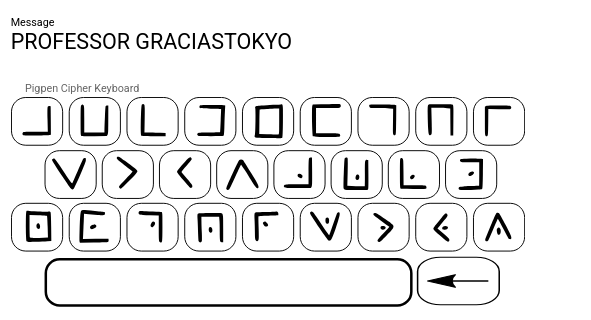

## WRITEUP - LA CASA DE L'INJECTION.
- **Category**: Web
- **Level:** : Medium

**Description:** Le professeur est attrapé par la police d'Espagne, et il a besoin de toi pour trouver deux document sur leur système privé. Ces documens contient le flag qui va innocenter le Professor.
Tu vas travailler avec l'equipe de Casa del Papel pour ca.

----------------------------------------------------------------------
## Step 1 :  Download the docker image
-----------------------------------------

-  The docker images is available on my docker hub.

<pre>Link : https://hub.docker.com/repositories/razafindraibe</pre>

<pre>sudo docker pull razafindraibe/la_casa_de_injection:latest</pre>

- Run the container :
<pre>sudo docker run -d -p 8080:5000 -p 21:21 -p 21100-21110:21100-21110 razafindraibe/la_casa_de_injection:latest</pre>

---------------------------------------------------------------------
## Step 2 : Reconnaissance

**1 - Let’s start with a simple IP scan using :** nmap

---------------------------------------------------------------------
**2 - Let's access the site :**

<pre>http://localhost:8080</pre>

We accessed the blog of the group.

El Profesor sent a photo to **Berlin** before his arrest.

Hmmm... it seems to be about steganography.

---------------------------------------------------------------------
**3- Download the photo**

Just click on it and it will be downloaded.

- Hint : Pigpen Cipher

Good job! We have credentials, either for FTP or for a login.

---------------------------------------------------------------------
**4 - Let's try to connect by ftp on port 21**

<pre>ftp 127.0.0.1</pre>

- username: professor
- password: graciastokyo

<pre>get document1.txt</pre>

Bravo !! We got the first document

---------------------------------------------------------------------
## Step 3 : Search the second document !

**Let’s continue our exploration with gobuster**

We have */portal* . It seems important.

It's a login page

---------------------------------------------------------------------
## Step 4 : Injection

As the name of the challenge is **LA CASA DE L'INJECTION**, maybe the website is vulnerable to SQL injection.

Boom!! It worked, and we accessed the **WEB SERVER COMMAND PANEL**

**/secret** and **/professor** are interesting .

Unfortunately .. We can't use cat. Let's try with another one.

Hummmmm... it's not the second document. Let's take a look on /professor

Bingo !!!!

We combined document1 and document2 contents, got the flag, and saved the Professor.

---------------------------------------------------------------------
